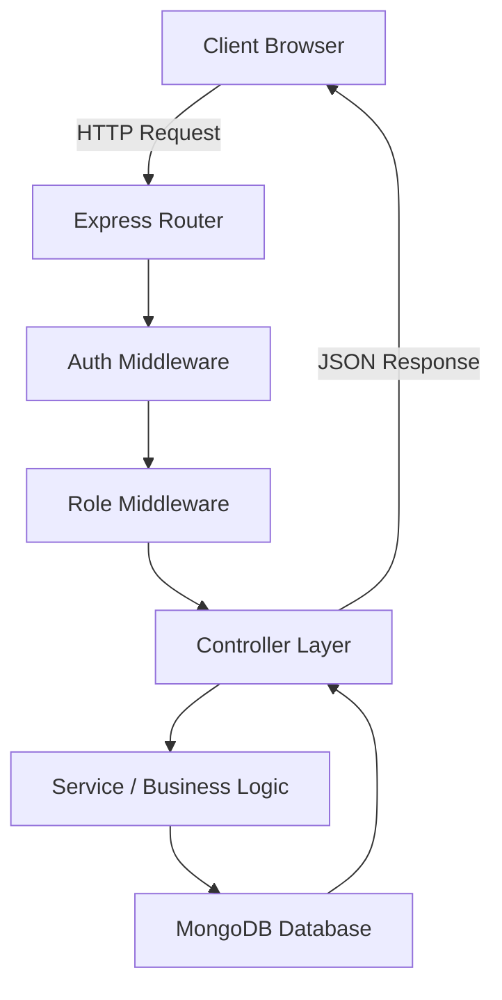
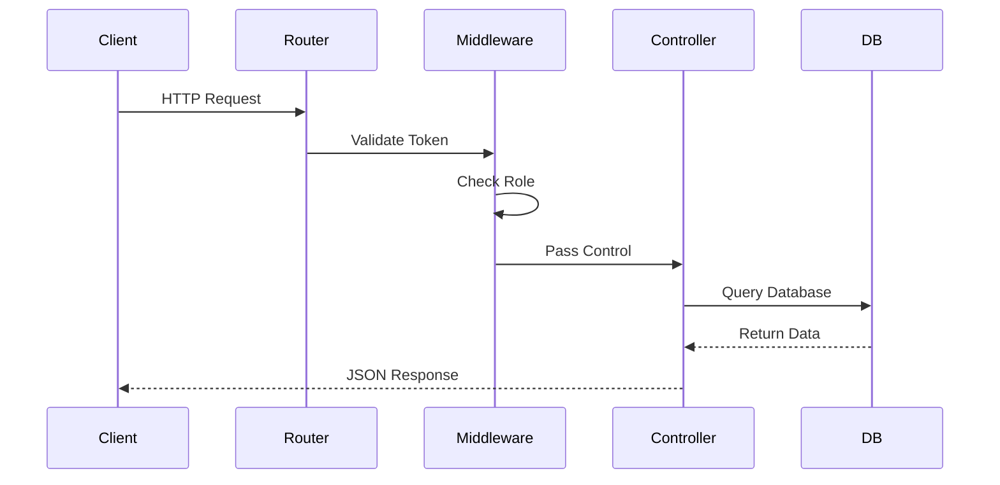

# 🚀 User Management System — Production-Structured REST API

<p align="center">
  
  
  
  
  
  
</p>

---

## 📌 Overview

A production-structured full-stack **User Management System** implementing secure authentication and role-based access control.

### Core Capabilities

* 🔐 JWT Authentication
* 🛡 Role-Based Authorization (`admin`, `user`)
* 🧱 Layered Express Architecture
* 🌐 Vanilla JS Frontend with Protected Routing
* 📖 Swagger API Documentation

This project demonstrates backend architecture discipline and real-world security patterns.

---

## 🧠 System Architecture



### Architectural Layers

```
Route → Middleware → Controller → Service Logic → Database → Response
```

Separation of concerns is strictly maintained.

---

## 🔄 Request Lifecycle



### Example: Admin Route Access

1. User sends request
2. JWT validated
3. Role verified
4. Database queried
5. Structured JSON returned

---

## 🔐 Authentication & Authorization Flow

### Registration

* Default role: `user`
* Password hashed with bcrypt

### Login

* Credentials validated
* JWT issued
* Role embedded inside token payload

### Frontend Behavior

* Decode JWT
* Redirect:
  * `admin` → Admin Dashboard
  * `user` → User Dashboard

### Backend Enforcement

```js
router.get("/admin", protect, authorize("admin"), controller);
```

Frontend checks = UI logic  
Backend middleware = real security

---

## 🗂 Project Structure

### Backend

```
src/
│
├── config/
├── controllers/
├── middleware/
├── models/
├── routes/
├── utils/
├── validators/
│
├── app.js
└── server.js
```

### Frontend

```
src/frontend/
│
├── css/
│   └── main.css
│
├── pages/
│   ├── auth.js
│   ├── login.js
│   ├── register.js
│   ├── dashboard.js
│   └── admin-dashboard.js
│
├── login.html
├── register.html
├── dashboard.html
└── admin-dashboard.html
```

---

## 🗺 API Endpoints

### Auth

| Method | Endpoint                | Description       |
| ------ | ----------------------- | ----------------- |
| POST   | `/api/v1/auth/register` | Register new user |
| POST   | `/api/v1/auth/login`    | Login user        |

### User

| Method | Endpoint                    | Access        |
| ------ | --------------------------- | ------------- |
| GET    | `/api/v1/users/profile`     | Authenticated |
| GET    | `/api/v1/users/admin-route` | Admin Only    |

---

## 📖 Swagger / OpenAPI Documentation

This project supports interactive API documentation using Swagger.

### Install Swagger Dependencies

```bash
npm install swagger-ui-express swagger-jsdoc
```

### Create `swagger.js` in src

```js
import swaggerJsdoc from "swagger-jsdoc";
import swaggerUi from "swagger-ui-express";

const options = {
  definition: {
    openapi: "3.0.0",
    info: {
      title: "User Management API",
      version: "1.0.0",
      description: "Production-structured REST API with JWT authentication"
    },
    servers: [
      {
        url: "http://localhost:5000"
      }
    ]
  },
  apis: ["./src/routes/*.js"]
};

const swaggerSpec = swaggerJsdoc(options);

export { swaggerUi, swaggerSpec };
```

### Integrate in app.js

```js
import { swaggerUi, swaggerSpec } from "./swagger.js";

app.use("/api-docs", swaggerUi.serve, swaggerUi.setup(swaggerSpec));
```

Now open:

```
http://localhost:5000/api-docs
```

Interactive API documentation will be available.

---

---

## ⚙️ Installation

### Clone Repository

```bash
git clone https://github.com/Tripadh/USER-MANAGEMENT-API.git
cd USER-MANAGEMENT-API
```

### Install Dependencies

```bash
npm install
```

### Configure Environment

Create `.env` file:

```
PORT=5000
MONGO_URI=your_mongodb_connection_string
JWT_SECRET=your_secret_key
JWT_EXPIRES_IN=1d
```

### Run Server

```bash
npm run dev
```

Open:

```
http://localhost:5000/login.html
```

---

## 🛡 Security Features

* bcrypt password hashing
* JWT expiration
* Role-based middleware
* Centralized error handling
* Input validation middleware
* Structured API responses

---

## 🚀 Future Improvements

* Refresh token rotation
* HttpOnly cookie-based authentication
* CSRF protection
* Admin user management table
* Pagination & filtering
* React frontend migration
* Docker containerization
* Cloud deployment (AWS / Render / Railway)

---

## 📊 What This Project Demonstrates

✔ Clean Express architecture  
✔ Middleware-based security layering  
✔ Role-based authorization  
✔ Structured request lifecycle  
✔ API documentation via Swagger  
✔ Frontend-backend integration  
✔ Production-level design thinking

---

## 👨‍💻 Author

Full-stack architecture project demonstrating secure authentication, role-based authorization, and production-structured backend design.

---

## 📜 License

MIT License
